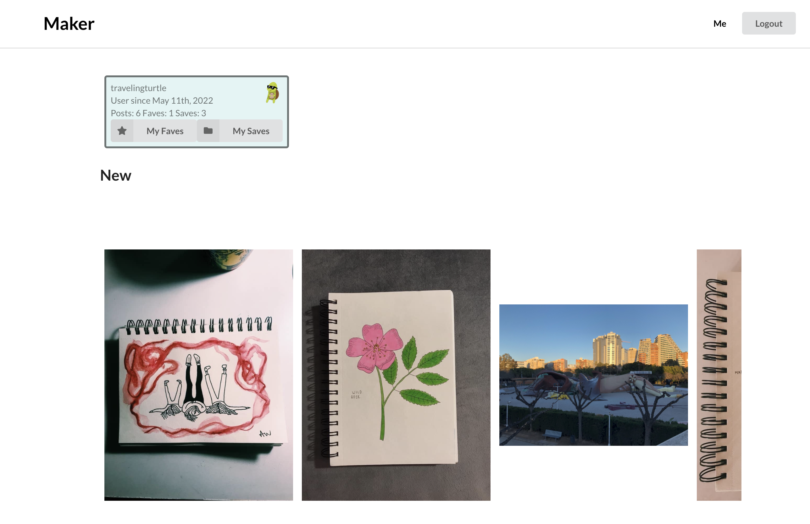
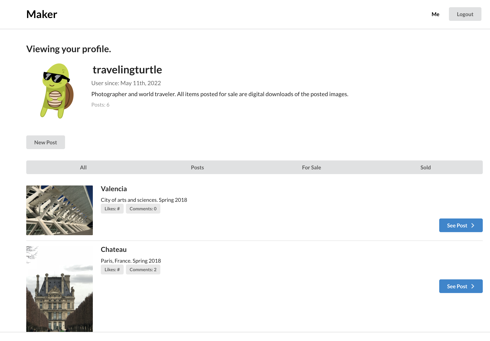

# Maker
MERN-stack web app aiming to consolidate the art community's web activity into a central location.

## Description
A social-media and ecommerce application for artists and art enthusiests, built to consolidate artists online presence and activities to centralize and enhance the online art community. This application was built with a MERN-stack. 

## Table of Contents
* [Usage](#usage)
* [Photo](#photo)
* [Technologies](#technologies)
* [License](#license)
* [Contributing](#contributions)
* [Tests](#tests)
* [Questions](#questions)

## Usage
This application's deployment is depracated and no longer usable. To view the application, please clone the repository to your device and run "npm install", then "npm run develop" in your terminal.'
View posts and artists. 
Create an account to make posts, add comments, save posts, and favorite artists. 

## Photo

## Technologies
* Git
* Node.js
* Express
* React
* MongoDB
* Mongoose ORM
* ApolloServer
* GraphQL
* JWT (JSONWebTokens)
* Semantic UI
* AWS S3
* Heroku

## License
None

## Contributing
This application is not open-source at this time. Feel free to fork or clone the repo to further develop this application for your own use!

## Tests
No testing required

## Additional Info
* Github: [kalecodes](https://github.com/kalecodes)